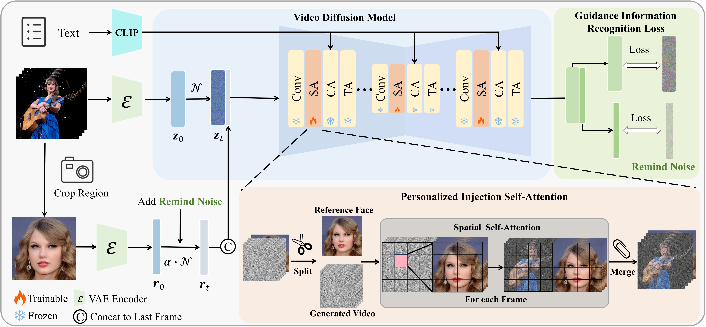

<div align="center">

# ✨VideoMaker✨
<p><b>VideoMaker: Zero-shot Customized Video Generation with the Inherent Force of Video Diffusion Models</b>.</p>

<!-- </img> -->

<a href='https://arxiv.org/abs/2412.19645'></a> &nbsp;
<a href='https://wutao-cs.github.io/VideoMaker'></a>  &nbsp;
[](https://huggingface.co/SugerWu/VideoMaker/tree/main)
<!-- [](https://huggingface.co/spaces/******) -->
</div>


## 🥳 Demo


Please check more demo videos at the [project page](https://wutao-cs.github.io/VideoMaker).

## 🔆 Abstract

> Zero-shot customized video generation has gained significant attention due to its substantial application potential. Existing methods rely on additional models to extract and inject reference subject features, assuming that the Video Diffusion Model (VDM) alone is insufficient for zero-shot customized video generation. However, these methods often struggle to maintain consistent subject appearance due to suboptimal feature extraction and injection techniques. In this paper, we reveal that VDM inherently possesses the force to extract and inject subject features. Departing from previous heuristic approaches, we introduce a novel framework that leverages VDM’s inherent force to enable high-quality zero-shot customized video generation. Specifically, for feature extraction, we directly input reference images into VDM and use its intrinsic feature extraction process, which not only provides fine-grained features but also significantly aligns with VDM’s pre-trained knowledge. For feature injection, we devise an innovative bidirectional interaction between subject features and generated content through spatial self-attention within VDM, ensuring that VDM has better subject fidelity while maintaining the diversity of the generated video. Experiments on both customized human and object video generation validate the effectiveness of our framework.

### 📋 TODO
- ✅ Release inference code and model weights
- ✅ Release arxiv paper
- ✅ Release gradio demo
- ⬜️ Release training code


## 😉 Pipline



## 📦 Installation

```bash
pip install -r requirements.txt
```

## 🛠️ Preparation
Prepare all pretrained models to `./pretrain_model/` folder.

Prepare pretrained Realistic_Vision_V5.1_noVAE weights
```bash
# Make sure you have git-lfs installed (https://git-lfs.com)
git lfs install
git clone https://huggingface.co/SG161222/Realistic_Vision_V5.1_noVAE
```

Prepare pretrained AnimateDiff SD1.5 weights
```bash
git clone https://huggingface.co/guoyww/animatediff-motion-adapter-v1-5-3
```

Prepare pretrained VideoMaker weights
```bash
git clone https://huggingface.co/SugerWu/VideoMaker
```


## 📊 Inference

### 💫 Custom Human Video Generation
We recommend using [Grounded-SAM-2](https://github.com/IDEA-Research/Grounded-SAM-2) or [SAM-2](https://github.com/facebookresearch/sam2) preprocess the input image so that only the facial area is retained in the reference image.
We provide some processed examples in `./examples/human`


```bash
# singe reference image single prompt inference
python inference.py \
  --seed 1234 \
  --prompt 'A person wearing a Superman outfit.' \
  --image_path 'examples/barack_obama.png' \
  --weight_path './pretrain_model/VideoMaker/human_pytorch_model.bin'

# singe reference image multiple prompt inference
python inference.py \
  --seed 1234 \
  --prompt './prompts/example.txt' \
  --image_path 'examples/barack_obama.png' \
  --weight_path './pretrain_model/VideoMaker/human_pytorch_model.bin'

# multiple reference image multiple prompt inference
python inference.py \
  --seed 1234 2048 \
  --prompt './prompts/example.txt' \
  --image_path 'examples/human/' \
  --weight_path './pretrain_model/VideoMaker/human_pytorch_model.bin'
```

### 📷 Custom object Video Generation
Due to the limitation of the VideoBooth datasets, we only support the following nine categories of objects: bear, car, cat, dog, elephant, horse, lion, panda, tiger. 
We recommend using [Grounded-SAM-2](https://github.com/IDEA-Research/Grounded-SAM-2) preprocess the input image so that only the main object is retained in the reference image.
```bash
# singe reference image single prompt inference
python inference.py \
  --seed 1234 \
  --prompt 'A horse running through a shallow stream.' \
  --image_path 'examples/object/horse1.jpg' \
  --weight_path './pretrain_model/VideoMaker/object_pytorch_model.bin'
```


## 🤗 Gradio Demo

### Start a local gradio demo
Run the following command:
```bash

# Custom Human Video Generation Demo
python gradio_demo/human_app.py 

# Custom object Video Generation Demo
python gradio_demo/object_app.py

```

## 📭Citation

If you find VideoMaker helpful to your research, please cite our paper:
```
@article{wu2024videomaker,
  title={Videomaker: Zero-shot customized video generation with the inherent force of video diffusion models},
  author={Wu, Tao and Zhang, Yong and Cun, Xiaodong and Qi, Zhongang and Pu, Junfu and Dou, Huanzhang and Zheng, Guangcong and Shan, Ying and Li, Xi},
  journal={arXiv preprint arXiv:2412.19645},
  year={2024}
}
```